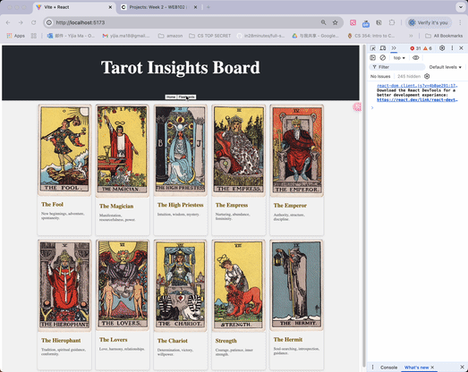

# Web Development Project 2 - *TarotFlashCards*

Submitted by: **Yijia Ma**

This web app: **Displays a flashcards board for tarot cards. Users can utilize it to learn their meanings, interpretations, and symbolism.**

Time spent: **4** hours spent in total

## Required Features

The following **required** functionality is completed:

- [X] **The title of the card set and some information about it, such as a short description and the total number of cards are displayed**
- [X] **A single card at a time is displayed, only showing one of the components of the information pair**
- [X] **A list of card pairs is created**
- [X] **Hovering on the card shows the corresponding component of the information pair**
- [X] **Clicking the next button displays a random new card**

The following **optional** features are implemented:

- [X] Cards contains images in addition to or in place of text
- [X] Cards have different visual styles such as color based on their category
  - [X] Light green Easy
  - [X] Light yellow Medium
  - [X] Light red Hard

The following **additional** features are implemented:

* [X] Remember history of cards we've reviewed. prevCard button allows traversal of history.

## Video Walkthrough

Here's a walkthrough of implemented required features:

GIF created with Kap

## Notes

Describe any challenges encountered while building the app.

## License

    Copyright [2025] [Yijia Ma]

    Licensed under the Apache License, Version 2.0 (the "License");
    you may not use this file except in compliance with the License.
    You may obtain a copy of the License at

        http://www.apache.org/licenses/LICENSE-2.0

    Unless required by applicable law or agreed to in writing, software
    distributed under the License is distributed on an "AS IS" BASIS,
    WITHOUT WARRANTIES OR CONDITIONS OF ANY KIND, either express or implied.
    See the License for the specific language governing permissions and
    limitations under the License.